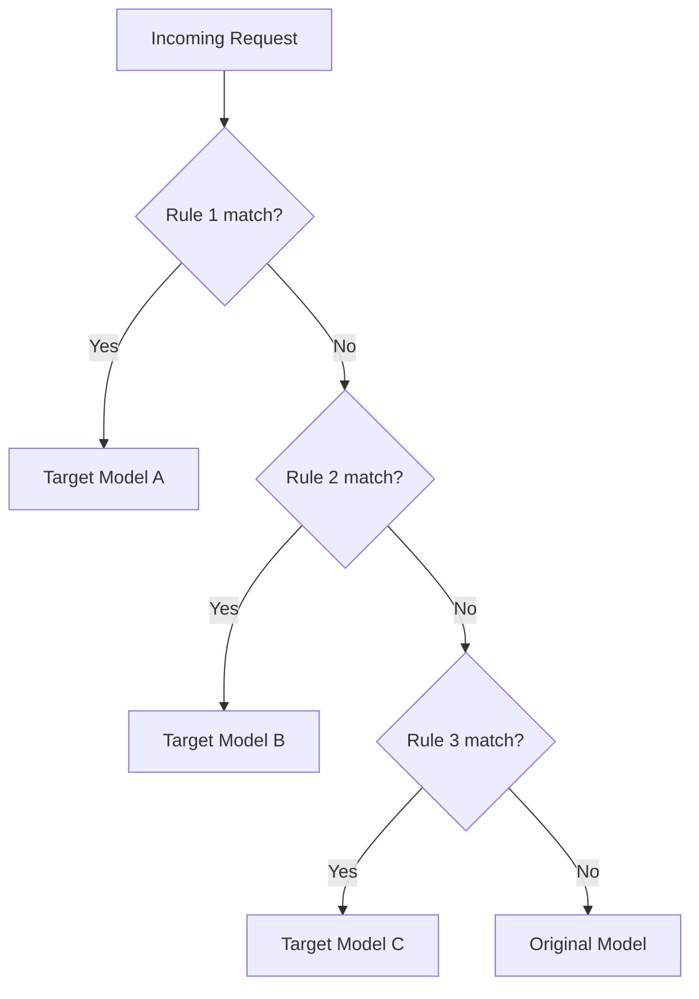

Routing rules let you dynamically redirect requests to different models based on conditions like cost, content, metadata, or custom logic. This enables cost optimization, load balancing, and model migration strategies.

## How Routing Works

When a request arrives, Raven evaluates routing rules in priority order. The first matching rule determines where the request is sent. If no rules match, the original model in the request is used.



## Creating a Routing Rule

Navigate to **Routing** in the dashboard and click **Create Rule**.

### Rule Configuration

| Field | Description |
|-------|-------------|
| **Name** | Descriptive name for the rule |
| **Priority** | Evaluation order (lower = higher priority) |
| **Condition** | When this rule should trigger |
| **Target Model** | The model to route to when the condition matches |
| **Target Provider** | Optionally pin to a specific provider |
| **Enabled** | Toggle the rule on/off |

## Condition Types

### Model-Based Routing

Route requests from one model to another:

```json
{
  "field": "model",
  "operator": "equals",
  "value": "gpt-4"
}
```

**Use case:** Gradually migrate from GPT-4 to GPT-4o without changing application code.

### Cost-Based Routing

Route to cheaper models for non-critical requests:

```json
{
  "field": "metadata.priority",
  "operator": "equals",
  "value": "low"
}
```

**Use case:** Send low-priority batch processing to a cost-effective model.

### Content-Based Routing

Route based on request content characteristics:

```json
{
  "field": "content_length",
  "operator": "greater_than",
  "value": "10000"
}
```

**Use case:** Send long-context requests to models with larger context windows.

## Fallback Routing

When a provider is down or returns errors, Raven can automatically fall back to an alternative provider. Configure fallback behavior in your routing rules to ensure high availability.

## Examples

### Cost Optimization

Route simple queries to cheaper models:

| Condition | Target |
|-----------|--------|
| Token estimate < 100 | `gpt-4o-mini` |
| Default | `gpt-4o` |

### Provider Failover

Set up automatic failover:

| Priority | Provider | Model |
|----------|----------|-------|
| 1 | OpenAI | `gpt-4o` |
| 2 | Azure OpenAI | `gpt-4o` |
| 3 | Anthropic | `claude-sonnet-4-20250514` |
