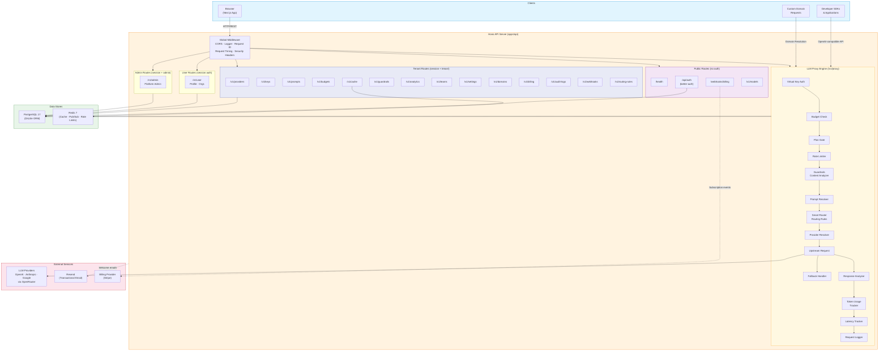
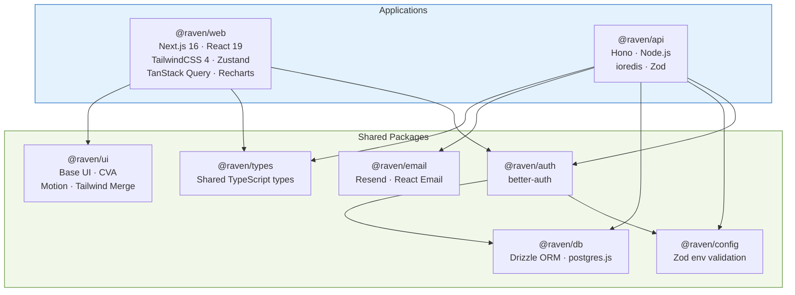
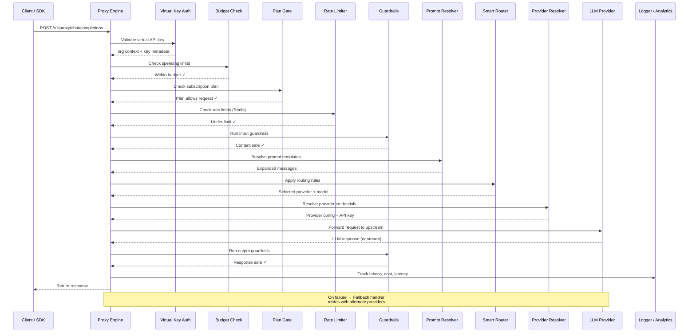
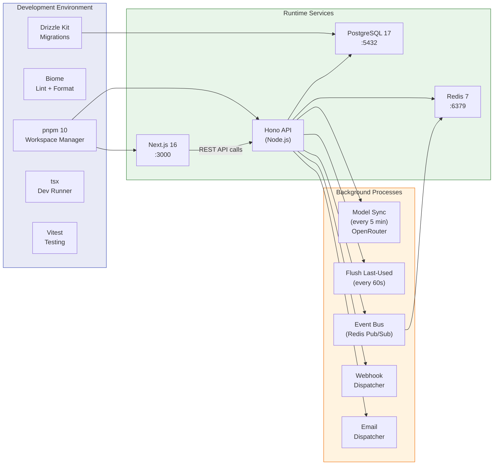

# Raven Platform Architecture

## High-Level System Architecture

## Monorepo Package Dependency Graph

## Database Schema (Entity Relationships)

```mermaid
erDiagram
    users ||--o{ members : "belongs to orgs"
    users ||--o{ invitations : "invited to"
    users ||--o{ sessions : "has sessions"
    users ||--o{ accounts : "auth accounts"

    organizations ||--o{ members : "has members"
    organizations ||--o{ teams : "has teams"
    organizations ||--o{ keys : "has API keys"
    organizations ||--o{ providers : "configures providers"
    organizations ||--o{ prompts : "manages prompts"
    organizations ||--o{ budgets : "sets budgets"
    organizations ||--o{ guardrail_rules : "defines guardrails"
    organizations ||--o{ routing_rules : "defines routing"
    organizations ||--o{ webhooks : "has webhooks"
    organizations ||--o{ custom_domains : "has domains"
    organizations ||--o{ subscriptions : "has subscription"
    organizations ||--o{ request_logs : "logs requests"
    organizations ||--o{ audit_logs : "tracks changes"
    organizations ||--o{ invitations : "has invitations"

    teams ||--o{ members : "has members"
    keys ||--o{ request_logs : "generates logs"
    providers ||--o{ models : "offers models"

    synced_providers ||--o{ models : "synced models"

    users {
        text id PK
        text name
        text email
        boolean platformAdmin
    }
    organizations {
        text id PK
        text name
        text slug
        jsonb settings
    }
    members {
        text id PK
        text orgId FK
        text userId FK
        text teamId FK
        text role
    }
    keys {
        text id PK
        text orgId FK
        text name
        text hashedKey
        text budgetId FK
    }
    providers {
        text id PK
        text orgId FK
        text type
        text apiKey
        boolean isDefault
    }
    models {
        text id PK
        text providerId FK
        text modelId
        bigint inputPrice
        bigint outputPrice
    }
    request_logs {
        text id PK
        text orgId FK
        text keyId FK
        text model
        integer tokens
        bigint cost
    }
    prompts {
        text id PK
        text orgId FK
        text name
        text content
        integer version
    }
    budgets {
        text id PK
        text orgId FK
        text name
        bigint limitAmount
        text period
    }
    routing_rules {
        text id PK
        text orgId FK
        text pattern
        jsonb config
    }
    guardrail_rules {
        text id PK
        text orgId FK
        text type
        jsonb config
    }
```

## LLM Proxy Request Flow

## Infrastructure & Deployment

